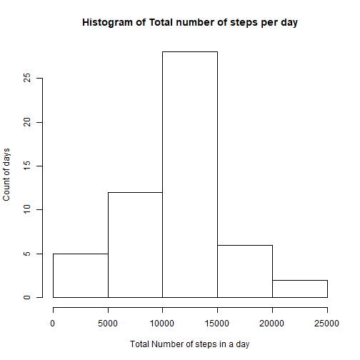

# R Markdown
## Introduction
This assignment makes uses of data from a personal activity monitoring device. The purpose is to provide a summary statistical description of the personal activity

## Data
The data are downloaded  from the web site <https://d396qusza40orc.cloudfront.net/> and the dataset contain 3 variables (collected from an anonymous individual collected during the months of October and Nomenber :

1. First variable= number of steps in a 5 minute interval

2. Second variable= the date on wich the measurement was taken

3. Third variable=identifier for the 5 minute interval on wich the measurement was taken

### Loading and preprocessing the data  

```r
  download.file("https://d396qusza40orc.cloudfront.net/repdata%2Fdata%2Factivity.zip",destfile="activ.zip")
  unzip("activ.zip")
 obs<-read.csv("activity.csv",sep=",",header=TRUE)
 obs$date<-as.Date(obs$date)
print(paste("we obtain a dataset of",dim(obs)[1],"observations and",dim(obs)[2],"variables:"))
```

```
## [1] "we obtain a dataset of 17568 observations and 3 variables:"
```


### First chart: histogram of the total number of steps taken each day

```r
h2<-obs[!is.na(obs$steps),]
library(dplyr)
j2<- h2 %>% group_by(date) %>% summarise(steps=sum(steps))
##j2$steps<-as.numeric(j2$steps)
library(ggplot2)
hist(j2$steps,xlab="Total Number of steps in a day",ylab="Count of days",main="Histogram of Total number of steps per day")
```



#### Report the mean and median of the total number of steps taken per day

```r
print(paste("the mean of the total number of steps taken per day is :",mean(j2$steps)))
```

```
## [1] "the mean of the total number of steps taken per day is : 10766.1886792453"
```

```r
print(paste("the median of the total number of steps taken per day is :",median(j2$steps)))
```

```
## [1] "the median of the total number of steps taken per day is : 10765"
```

### Second chart: Time series plot of the average daily number of steps 


```r
j3<-h2 %>% group_by(interval) %>% summarise(steps=mean(steps))

ggplot(j3,aes(x=interval,y=steps),font.main=2)+geom_line()+ggtitle("Average daily activity pattern")+xlab("5 minutes Interval")+ylab("Steps (Average across all days)")+theme(plot.title=element_text(size=15,face="bold",hjust=0.5))+theme(axis.title=element_text(size=10))
```


#### Identification which 5 minute interval contains the maximum number of steps

```r
j3m<-max(j3$steps)
j3i<-j3$interval[j3$steps==j3m][1]
print(paste("the 5 minutes interval No",j3i,"contains the maximal number of steps"))
```

```
## [1] "the 5 minutes interval No 835 contains the maximal number of steps"
```

### Calculating total number of  missing data and strategy for imputing missing data

```r
print(paste("The sample contain",sum(is.na(obs$steps)),"missing data"))
```

```
## [1] "The sample contain 2304 missing data"
```

```r
## Strategy de redressement des données manquantes
h3<-obs
for (i in 1:nrow(h3)){
if (is.na(h3$steps[i]))    {
h3$steps[i]<-j3$steps[j3$interval==h3$interval[i]][1]
}
}
```


### Third chart: Histogram of the total number of steps taken each day ( after missing data are imputed)


```r
j3<- h3 %>% group_by(date) %>% summarise(steps=sum(steps))
hist(j3$steps,xlab="Total Number of steps in a day",ylab="Count of days",main="Histogram of Total number of steps per day")
```


#### Report the mean and median of the total number of steps taken per day ( after missing data are imputed)

```r
print(paste("the mean of the total number of steps taken per day is :",mean(j3$steps)))
```

```
## [1] "the mean of the total number of steps taken per day is : 10766.1886792453"
```

```r
print(paste("the median of the total number of steps taken per day is :",median(j3$steps)))
```

```
## [1] "the median of the total number of steps taken per day is : 10766.1886792453"
```

```r
print("CONCLUSION > No true impact of imputing missing data!")
```

```
## [1] "CONCLUSION > No true impact of imputing missing data!"
```


### Fourth chart: Time series plot of the average daily number of steps 

```r
h3p<-h3
h3p$date<-ifelse(weekdays(h3p$date)=="samedi"|weekdays(h3p$date)=="dimanche"|weekdays(h3p$date)=="Saturday"|weekdays(h3p$date)=="Sunday","weekend","weekday")
j3p<-h3p %>% group_by(interval,date) %>% summarise(steps=mean(steps))

ggplot(j3p,aes(x=interval,y=steps),font.main=2)+geom_line()+ggtitle("Average daily activity pattern")+facet_grid(.~date)+xlab("5 minutes Interval")+ylab("Steps (Average across all days)")+theme(plot.title=element_text(size=15,face="bold",hjust=0.5))+theme(axis.title=element_text(size=10))
```


```r
print("CONCLUSION > personal activity il less important during weekend than during weekdays")
```

```
## [1] "CONCLUSION > personal activity il less important during weekend than during weekdays"
```

